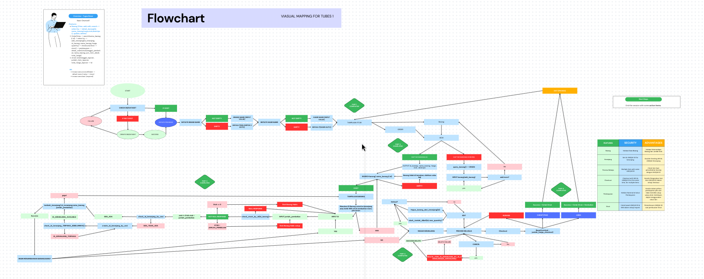

# Antares Cashier

Welcome to Antares Cashier System, an advanced point-of-sale system designed to streamline your sales process and enhance customer experience.

## Flowchart

## Key Features
1. **Program Initialization**: The program initializes the merchant name and cashier name when first run.
2. **Main Menu**: Users can choose between options such as "New Order" to start a new transaction, "Display Item List" to view the list of available items, and "Exit" to quit the program.
3. **Add Items to Cart**: Users can enter the item ID and quantity to add items to the shopping cart.
4. **Cart Preview**: Users can view a preview of the shopping cart contents, including the list of items, quantities, and total price.
5. **Edit Cart**: Users can edit the shopping cart, including removing items from the cart and changing the quantity of purchased items.
6. **Checkout Process**: Users can proceed with the checkout process to finalize the purchase transaction.
7. **Input Validation**: The program validates user input to ensure that the entered input matches the expected format.
8. **Merchant and Cashier Information**: The program displays information about the merchant name and cashier name during program initialization.
9. **Security Features**: The program includes security features by requesting confirmation before canceling the shopping cart.

## How to Use
1. Run the program by executing the `antares.c` executable file.
2. Choose the desired option from the main menu.
3. Follow the instructions to add items to the cart, edit the cart, or proceed with checkout.
4. Complete the transaction by selecting the checkout option when finished.
5. The program will provide the total transaction amount and print the purchase receipt.

## Contribution
Contributions in the form of pull requests or bug reports are welcomed. Please open an issue for further discussion.

## License
No license currently. Created by Antares Team - 2 Jan, 2024.
